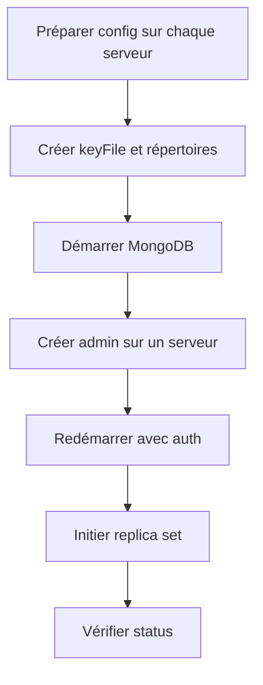

Voici une procédure détaillée pour mettre en place un **replica set MongoDB** avec trois serveurs (dbsrv1, dbsrv2, dbsrv3) sous forme d’exercice, incluant la configuration, la création d’utilisateurs et la vérification du statut de la réplication.

## 🛠️ Préparation des Fichiers de Configuration

Sur chaque serveur, préparez un fichier de configuration MongoDB (exemple : `/etc/mongod.conf`).  
Remplacez `` par le nom de votre choix (exemple : `rs0`) et adaptez les chemins de stockage/logs selon votre environnement[1][2].

```yaml
storage:
  dbPath: /data/mongo
systemLog:
  destination: file
  path: /var/log/mongodb/mongod.log
  logAppend: true
processManagement:
  fork: true
replication:
  replSetName: rs0
security:
  authorization: enabled
  keyFile: /data/mongo/key
net:
  bindIp: 0.0.0.0
  port: 27017
```
> **Remarque** :  
> - Le `keyFile` est utilisé pour sécuriser la communication interne du replica set[1][3].
> - `bindIp: 0.0.0.0` pour autoriser les connexions depuis d'autres machines (à adapter selon votre politique de sécurité).

## 🗃️ Création des Répertoires et Mise en Place du keyFile

Exécutez ces commandes sur chaque serveur :

```bash
mkdir -p /data/mongo
chown -R mongodb:mongodb /data/mongo
chmod 755 /data
chmod -R 700 /data/mongo
mkdir -p /var/log/mongodb
chown -R mongodb:mongodb /var/log/mongodb
```
Générez le `keyFile` sur un serveur puis copiez-le sur les autres :

```bash
openssl rand -base64 741 > /data/mongo/key
chown mongodb:mongodb /data/mongo/key
chmod 400 /data/mongo/key
```
Copiez le contenu du fichier `/data/mongo/key` sur les autres serveurs et placez-le au même emplacement avec les mêmes permissions[1].

## 🚀 Démarrage du Service MongoDB

Sur chaque serveur, démarrez MongoDB :

```bash
systemctl start mongod
```
Vérifiez les logs pour détecter d’éventuelles erreurs :

```bash
tail -n 50 -f /var/log/mongodb/mongod.log
```

## 👤 Création de l’Utilisateur Admin

Connectez-vous à un serveur (sélectionnez le futur PRIMARY, souvent le premier démarré) :

```bash
mongo
```
Créez l’utilisateur administrateur (avant d’activer l’authentification sur tout le replica set) :

```javascript
use admin
db.createUser({
  user: "admin",
  pwd: "AdminPassword!",
  roles: [ { role: "root", db: "admin" } ]
})
```
Sortez de la console MongoDB (`exit`), puis redémarrez chaque instance avec la configuration d’authentification activée (`security.authorization: enabled` et `keyFile`)[3][4].

## 🔄 Initialisation du Replica Set

Connectez-vous à nouveau à MongoDB sur le serveur choisi pour l’initialisation (toujours via `mongo`), puis initiez le replica set :

```javascript
var conf = {
  "_id": "rs0",
  "members": [
    { "_id": 0, "host": "192.168.56.191:27017" },
    { "_id": 1, "host": "192.168.56.192:27017" },
    { "_id": 2, "host": "192.168.56.193:27017" }
  ]
}
rs.initiate(conf)
```
Attendez quelques secondes pour que la synchronisation se fasse.

## 🔍 Droits de l’Utilisateur Admin

- **Rôle root** : Accès administrateur total à toutes les bases et toutes les opérations (CRUD, gestion des utilisateurs, gestion du cluster, etc.).
- **Droits** : Peut créer/dropper des utilisateurs, gérer les rôles, accéder à n’importe quelle base, effectuer toute opération d’administration[3][4].

## ✅ Vérification de la Configuration et du Statut

Connectez-vous à MongoDB avec l’utilisateur admin :

```bash
mongo --host 192.168.56.191 --port 27017 -u admin -p AdminPassword! --authenticationDatabase admin
```
Vérifiez la configuration du replica set :

```javascript
rs.conf()
```
Vérifiez l’état du replica set :

```javascript
rs.status()
```
La commande `rs.status()` retourne :
- **set** : nom du replica set.
- **date** : date/heure de la requête.
- **myState** : état du serveur local (1 = PRIMARY, 2 = SECONDARY).
- **members** : tableau détaillant chaque membre (host, health, state, etc.)[5][6][7].

## 📊 Résumé des Commandes et Points Clés

| Étape                  | Commande/Configuration                                                                 |
|------------------------|---------------------------------------------------------------------------------------|
| Configuration          | `/etc/mongod.conf` (voir exemple ci-dessus)                                           |
| keyFile                | `openssl rand -base64 741 > /data/mongo/key`                                          |
| Démarrage              | `systemctl start mongod`                                                              |
| Création admin         | `db.createUser({ user: "admin", pwd: "AdminPassword!", roles: [ { role: "root", ...`  |
| Initiation replica set | `rs.initiate({ _id: "rs0", members: [...] })`                                         |
| Vérification           | `rs.conf()`, `rs.status()`                                                            |

## ⚠️ Points de Vigilance

- **Sécurité** : Protégez le fichier `keyFile` et limitez l’accès réseau aux serveurs du replica set uniquement.
- **Continuité de service** : Assurez-vous que les serveurs peuvent communiquer entre eux (ports ouverts, pare-feu adapté).
- **Vol de données** : Utilisez des mots de passe forts et des rôles adaptés pour limiter les accès.
- **Synchronisation** : Vérifiez régulièrement le statut de la réplication avec `rs.status()` pour détecter tout problème de synchro ou de disponibilité[6][7].

## 🧩 Diagramme de la Procédure (simplifié)



Cette procédure permet de déployer un replica set MongoDB sécurisé et opérationnel sur trois serveurs.

[1] https://github.com/veliovgroup/ostrio/blob/master/tutorials/mongodb/multiple-server-replica-set.md
[2] https://severalnines.com/blog/developer-s-guide-mongodb-replica-sets/
[3] https://stackoverflow.com/questions/21724777/how-to-initiate-authentication-for-replica-set-mongodb
[4] https://www.dragonflydb.io/faq/mongodb-replica-set-username-password
[5] https://www.mongodb.com/docs/manual/reference/method/rs.status/
[6] https://www.dragonflydb.io/faq/how-to-check-mongodb-replication-status
[7] https://www.dragonflydb.io/faq/mongodb-get-replica-set-status
[8] https://www.mongodb.com/docs/manual/core/replica-set-architecture-three-members/
[9] https://www.mongodb.com/community/forums/t/three-member-replica-set-across-data-center/127932
[10] https://www.mongodb.com/community/forums/t/replica-set-with-3-db-nodes-and-1-arbiter/5599
[11] https://www.mongodb.com/community/forums/t/adding-a-new-user-to-admin-db-in-replica-set-forces-one-secondary-offline/245219
[12] https://www.mongodb.com/docs/manual/tutorial/deploy-replica-set-with-keyfile-access-control/
[13] https://www.mongodb.com/docs/manual/tutorial/expand-replica-set/
[14] https://dba.stackexchange.com/questions/111727/mongo-create-a-user-as-admin-for-any-database-raise-an-error
[15] https://www.mongodb.com/docs/manual/reference/command/replSetGetStatus/
[16] https://www.mongodb.com/docs/manual/tutorial/troubleshoot-replica-sets/
[17] https://www.mongodb.com/community/forums/t/setup-replica-set-in-3-nodes-including-web-server/15614
[18] https://www.filecloud.com/supportdocs/fcdoc/latest/server/filecloud-administrator-guide/filecloud-site-setup/filecloud-high-availability/installation-and-configuration-of-3-server-mongodb-cluster
[19] https://stackoverflow.com/questions/23210587/how-to-configure-a-replica-set-with-mongodb
[20] https://stackoverflow.com/questions/72277861/mongodb-hostname-ip-changed-for-all-hosts-in-sharding-with-replica-set-configu
[21] https://sysadmins.co.za/setup-a-3-node-mongodb-replica-set-on-ubuntu-20/
[22] https://www.xuchao.org/docs/mongodb/tutorial/deploy-replica-set.html
[23] https://stackoverflow.com/questions/70681444/docker-compose-mongodb-replicaset-with-admin-user/70681851
[24] https://www.mongodb.com/docs/manual/reference/built-in-roles/
[25] https://www.atlantic.net/dedicated-server-hosting/how-to-create-a-user-and-add-a-role-in-mongodb/
[26] https://studio3t.com/knowledge-base/articles/mongodb-users-roles-explained-part-2/
[27] https://serverfault.com/questions/862277/why-does-mongos-rs-status-show-secondary-as-healthy-when-its-offline
[28] https://stackoverflow.com/questions/19675117/how-to-check-secondary-is-synced-now-or-not
[29] https://docs.huihoo.com/mongodb/3.2/reference/method/rs.status.html