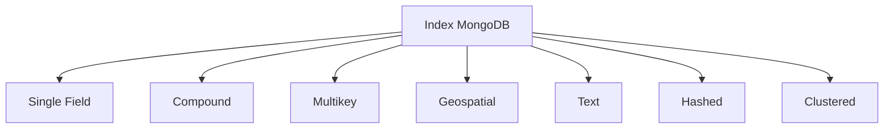

MongoDB propose une gamme variée d’index pour optimiser la performance des requêtes, chacun adapté à des cas d’usage spécifiques. Voici une description détaillée des principaux types d’index et des solutions basées sur ces index.

## 📊 Types d’index dans MongoDB

| Type d’index         | Description                                                                                         | Cas d’usage principal                      |
|----------------------|-----------------------------------------------------------------------------------------------------|--------------------------------------------|
| **Single Field**     | Indexe un seul champ dans chaque document.                                                          | Requêtes simples sur un champ unique.      |
| **Compound**         | Indexe deux ou plusieurs champs dans un ordre précis.                                               | Requêtes combinées sur plusieurs champs.   |
| **Multikey**         | Indexe chaque élément d’un tableau dans un champ.                                                   | Requêtes sur des tableaux ou sous-documents.|
| **Geospatial**       | Optimise les requêtes sur des données géospatiales (latitude, longitude).                           | Géolocalisation, cartographie.             |
| **Text**             | Permet la recherche de texte sur des champs de type chaîne ou tableau de chaînes.                   | Recherche plein texte, moteur de recherche.|
| **Hashed**           | Indexe la valeur hachée d’un champ. Utilisé principalement pour le sharding.                        | Partitionnement des données (sharding).    |
| **Clustered**        | (Depuis MongoDB 5.3) Définit l’ordre physique de stockage des documents dans une collection.         | Optimisation des accès séquentiels.        |

### 🔎 Détail de chaque type

- **Single Field Index**  
  Indexe un seul champ dans chaque document, utile pour accélérer les requêtes filtrant ou triant sur ce champ[1][2][3].
- **Compound Index**  
  Combine plusieurs champs dans un seul index, dans un ordre précis. L’ordre des champs est important pour l’efficacité des requêtes. Suivre la règle ESR (Equality, Sort, Range) pour l’ordre des champs[4][3].
- **Multikey Index**  
  Indexe automatiquement chaque élément d’un tableau dans un champ. Idéal pour les requêtes sur des tableaux ou des sous-documents[1][5][3].
- **Geospatial Index**  
  Deux types principaux : `2d` (géométrie plane) et `2dsphere` (géométrie sphérique). Utilisé pour les requêtes de proximité, de zone ou de géolocalisation[1][6].
- **Text Index**  
  Permet la recherche de texte sur des champs de type chaîne ou tableau de chaînes. Supporte la recherche de mots, la pondération et la langue[1][5][3].
- **Hashed Index**  
  Indexe la valeur hachée d’un champ. Utilisé principalement pour distribuer uniformément les données lors du sharding[1][6].
- **Clustered Index**  
  (Nouveau depuis MongoDB 5.3) Définit l’ordre physique de stockage des documents dans une collection, ce qui peut accélérer les accès séquentiels[1].

## ⚙️ Solutions et bonnes pratiques basées sur les indexes

- **Requêtes couvertes**  
  Une requête est dite couverte si tous les champs nécessaires sont présents dans l’index, permettant à MongoDB de répondre sans accéder aux documents sources. Cela améliore considérablement la performance[4].
- **Index partiels**  
  Réduit la taille de l’index en ne l’appliquant qu’à un sous-ensemble de documents répondant à un critère spécifique (ex : indexer uniquement les documents actifs)[4][6].
- **Index uniques**  
  Garantit l’unicité des valeurs dans un champ ou un ensemble de champs indexés, utile pour éviter les doublons (ex : adresse e-mail)[7].
- **Règle ESR (Equality, Sort, Range)**  
  Pour les index composés, il est recommandé de placer d’abord les champs utilisés pour l’égalité, puis ceux utilisés pour le tri, et enfin ceux utilisés pour les plages de valeurs[4][3].
- **Surveillance et gestion des index**  
  Utiliser des outils comme MongoDB Compass ou Atlas Data Explorer pour visualiser l’utilisation des index et supprimer ceux qui ne sont plus utilisés, afin de limiter la surcharge et d’optimiser les performances[4][6].
- **Index de texte avancés**  
  Sur MongoDB Atlas, utiliser Atlas Search ou Atlas Vector Search pour des fonctionnalités de recherche plein texte avancées et la recherche sémantique[1][4].

## 💻 Exemples de commandes

```javascript
// Single Field Index
db.collection.createIndex({ champ: 1 })

// Compound Index
db.collection.createIndex({ champ1: 1, champ2: -1 })

// Multikey Index (automatique sur un tableau)
db.collection.createIndex({ tableau: 1 })

// Text Index
db.collection.createIndex({ texte: "text" })

// Hashed Index
db.collection.createIndex({ champ: "hashed" })

// Index partiel
db.collection.createIndex({ champ: 1 }, { partialFilterExpression: { status: "actif" } })
```

## ✅ Avantages

- **Amélioration significative de la performance des requêtes**
- **Support de requêtes complexes et spécialisées**
- **Flexibilité pour adapter l’indexation aux besoins spécifiques de l’application**

## ❌ Inconvénients

- **Augmentation de la charge d’écriture et de la consommation de stockage**
- **Risque de surindexation si les index ne sont pas surveillés**
- **Complexité accrue de la gestion des index dans les environnements distribués**

## ⚠️ Points de vigilance

- **Éviter la surindexation** : trop d’index peuvent ralentir les opérations d’écriture et consommer inutilement des ressources[6].
- **Surveiller l’utilisation des index** : supprimer les index inutilisés pour maintenir l’efficacité[4][6].
- **Vérifier la couverture des requêtes** : utiliser `explain()` pour s’assurer que les requêtes profitent des index[4][8].
- **Attention aux expressions régulières** : les expressions non ancrées ou insensibles à la casse peuvent rendre l’indexation inefficace[4].

## 📈 Diagramme : Types d’index MongoDB



MongoDB offre ainsi un large panel d’options d’indexation, permettant de répondre efficacement aux besoins de performance et de fonctionnalité des applications modernes[1][2][6].

[1] https://www.mongodb.com/docs/manual/core/indexes/index-types/
[2] https://www.bmc.com/blogs/mongodb-indexes/
[3] https://studio3t.com/fr/knowledge-base/articles/mongodb-index-strategy/
[4] https://www.mongodb.com/blog/post/performance-best-practices-indexing-fr
[5] https://welovedevs.com/fr/articles/mongodb-index/
[6] https://www.datacamp.com/fr/blog/what-is-mongodb
[7] https://cursa.app/fr/page/indexation-dans-mongodb
[8] https://labex.io/fr/tutorials/mongodb-use-mongodb-indexes-422098
[9] https://www.mongodb.com/docs/manual/applications/indexes/
[10] https://cursa.app/fr/page/optimisation-des-requetes-dans-mongodb
[11] https://rtavenar.github.io/mongo_book/content/04_index.html
[12] https://learn.microsoft.com/fr-fr/azure/cosmos-db/mongodb/vcore/how-to-create-indexes
[13] https://www.mongodb.com/ja-jp/docs/upcoming/core/indexes/index-types/
[14] https://www.geopits.com/blog/mongodb-indexing-strategies.html