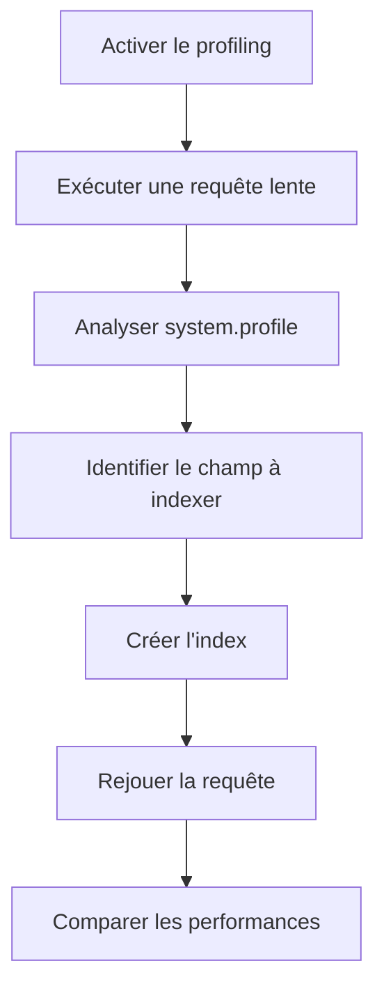

## 📋 Exercice Complet : Profiling des Requêtes Lentes et Impact d’un Index dans MongoDB

### Objectif

- Apprendre à profiler les requêtes lentes dans MongoDB.
- Ajouter un index sur un champ pertinent.
- Comparer les performances avant/après l’indexation.

### ⚙️ Étapes de l’Exercice

#### 1. Préparation de la Collection

Supposons une collection `clients` avec le schéma suivant :

```json
{
  "_id": ObjectId(),
  "nom": "Dupont",
  "ville": "Paris",
  "age": 35
}
```

Insérez un grand nombre de documents pour simuler un cas réel :

```js
for (let i = 0; i 100ms par défaut)
db.setProfilingLevel(1, { slowms: 50 });
// Vérifier le statut
db.getProfilingStatus();
```
*Le niveau 2 log toutes les opérations, mais attention à l’impact sur les performances[1][2].*

#### 3. Exécution d’une Requête Lente

Exécutez une requête sans index sur le champ `ville` :

```js
db.clients.find({ ville: "Lyon" }).explain("executionStats")
```

- Observez le plan d’exécution (`COLLSCAN` = scan complet de la collection).
- Notez le temps d’exécution (`executionTimeMillis`).

#### 4. Analyse des Requêtes Lentes

Consultez les requêtes lentes enregistrées :

```js
db.system.profile.find().sort({ ts: -1 }).limit(5).pretty()
```
- Repérez la requête sur `ville` et son temps d’exécution[1][2].

#### 5. Ajout d’un Index

Créez un index sur le champ `ville` :

```js
db.clients.createIndex({ ville: 1 })
```

#### 6. Nouvelle Exécution de la Requête

Répétez la requête :

```js
db.clients.find({ ville: "Lyon" }).explain("executionStats")
```

- Vérifiez que le plan d’exécution utilise l’index (`IXSCAN`).
- Notez le nouveau temps d’exécution.

#### 7. Comparaison des Résultats

| Étape                | Plan d’exécution | Temps d’exécution (ms) | Index utilisé |
|----------------------|------------------|------------------------|--------------|
| Avant index          | COLLSCAN         | élevé                  | Non          |
| Après ajout d’index  | IXSCAN           | faible                 | Oui          |

### ✅ Avantages

- **Amélioration significative des temps de réponse** pour les requêtes filtrant sur le champ indexé[3][4].
- **Réduction de la charge I/O** : moins de documents à parcourir.
- **Profiling précis** : identification rapide des requêtes à optimiser[1][2].

### ❌ Inconvénients

- **Impact sur les performances d’écriture** : chaque insertion/modification doit mettre à jour l’index[3][4][5].
- **Consommation d’espace disque** supplémentaire pour stocker l’index.
- **Sur-indexation** : trop d’index peut dégrader les performances globales[4].

### ⚠️ Points de vigilance

- **Profiling niveau 2** : à éviter en production, car il log toutes les opérations et peut saturer le disque[2].
- **Sur-indexation** : n’indexez que les champs réellement utilisés dans les requêtes fréquentes.
- **Sécurité** : l’accès à la collection `system.profile` doit être restreint, car elle peut contenir des informations sensibles sur les requêtes et les données.

### 💻 Exemples de Commandes Résumées

```js
// Activer le profiling pour les requêtes lentes
db.setProfilingLevel(1, { slowms: 50 });

// Requête lente sans index
db.clients.find({ ville: "Lyon" }).explain("executionStats");

// Créer un index
db.clients.createIndex({ ville: 1 });

// Requête optimisée avec index
db.clients.find({ ville: "Lyon" }).explain("executionStats");

// Consulter les requêtes lentes
db.system.profile.find().sort({ ts: -1 }).limit(5).pretty();
```

### 📊 Tableau Récapitulatif des Paramètres Clés

| Paramètre                | Description                                      | Exemple/Commande                  |
|--------------------------|--------------------------------------------------|-----------------------------------|
| Profiling Level          | Niveau de log des requêtes                       | `db.setProfilingLevel(1, { slowms: 50 })` |
| slowms                   | Seuil (ms) pour considérer une requête comme lente | `slowms: 50`                      |
| Index                    | Structure d’optimisation des requêtes            | `db.clients.createIndex({ ville: 1 })`    |
| system.profile           | Collection des logs de profiling                 | `db.system.profile.find()`         |

### 📈 Diagramme Mermaid : Processus de Profiling et Optimisation



Cet exercice vous permet de maîtriser le cycle complet d’identification, d’analyse et d’optimisation des requêtes lentes dans MongoDB grâce au profiling et à l’indexation[1][3][2][4][6].

[1] https://axiansdb.com/tracer-les-requetes-lentes-sous-mongodb/
[2] https://fre.myservername.com/mongodb-database-profiler
[3] https://studio3t.com/fr/knowledge-base/articles/mongodb-index-strategy/
[4] https://www.percona.com/blog/want-mongodb-performance-you-will-need-to-add-and-remove-indexes/
[5] https://www.mongodb.com/docs/manual/indexes/
[6] https://docs.aws.amazon.com/fr_fr/documentdb/latest/developerguide/user_diagnostics.html
[7] https://welovedevs.com/fr/articles/mongodb/
[8] https://www.arolla.fr/formation-mongodb-pour-les-developpeurs-java/
[9] https://empire-training.tn/itgate_formations/formation-mongodb-pour-developpeur/
[10] https://welovedevs.com/fr/articles/mongodb-index/
[11] https://www.datacamp.com/fr/tutorial/mongodb-find
[12] https://www.youtube.com/watch?v=7PUOvFwk7Ow
[13] https://kinsta.com/fr/blog/operateurs-mongodb/
[14] https://www.innov-systems.com/telecharger-fiche/BSI37
[15] https://perspective.orange-business.com/fr/tutoriel-mongodb-indexation-performance/
[16] https://hidora.io/ressources/comment-utiliser-la-recherche-plein-texte-dans-mongodb/
[17] https://fr.slideshare.net/slideshow/corrig-tp-nosql-mongodb-5pdf/265052421
[18] https://www.mongodb.com/fr-fr/cloud/atlas/performance
[19] https://rtavenar.github.io/mongo_book/content/04_index.html
[20] https://studio3t.com/fr/knowledge-base/articles/mongodb-aggregation-framework/