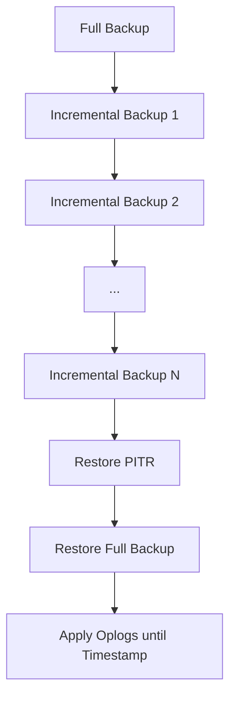

Voici une description technique détaillée de la sauvegarde et restauration PITR (Point-In-Time Recovery) incrémentale avec MongoDB, incluant les avantages, inconvénients et exemples de commandes.

## 🕒 Sauvegarde et Restauration PITR (Incrémentale) – Définition

La **Point-In-Time Recovery (PITR)** permet de restaurer une base de données à un instant précis dans le passé, en combinant une sauvegarde complète (full backup) avec des sauvegardes incrémentales basées sur l’oplog (journal des opérations de MongoDB)[1][2][3]. Cette technique est particulièrement utile pour récupérer après une erreur humaine ou une corruption de données.

## ⚙️ Principe de Fonctionnement

- **Sauvegarde complète** : capture l’état initial de la base à un instant T.
- **Sauvegardes incrémentales** : capturent les opérations ultérieures (insertions, mises à jour, suppressions) via l’oplog, permettant de rejouer les modifications jusqu’à un instant précis.
- **Restitution** : restauration de la sauvegarde complète, puis application des opérations de l’oplog jusqu’au point de restauration souhaité.

## 📊 Exemple de Stratégie

1. **Full backup** à minuit.
2. **Incremental backups** toutes les heures (ou toutes les 15 minutes selon la criticité).
3. **Restauration PITR** : choisir le point de restauration (ex : 6h du matin), restaurer la full backup puis appliquer les incrementals jusqu’à 6h.

## 💻 Commandes et Paramètres Clés

### Sauvegarde

- **mongodump** (full backup) :
  ```bash
  mongodump --out /chemin/vers/backup
  ```
- **Sauvegarde de l’oplog** (incremental) :
  ```bash
  mongodump --db local --collection oplog.rs --out /chemin/vers/oplog_backup
  ```
  *(À répéter à intervalle régulier selon la stratégie)*

### Restauration PITR

1. **Restaurer la full backup** :
   ```bash
   mongorestore /chemin/vers/backup
   ```
2. **Appliquer les opérations de l’oplog** jusqu’à l’instant souhaité :
   ```bash
   mongorestore --oplogReplay --oplogLimit  /chemin/vers/oplog_backup
   ```
   - **`--oplogReplay`** : active la lecture de l’oplog.
   - **`--oplogLimit `** : limite la restauration jusqu’au timestamp spécifié (ex : `1667917939,1` pour un timestamp précis)[2].

## ✅ Avantages

- **Précision** : restauration possible à l’instant exact souhaité, même entre deux sauvegardes incrémentales.
- **Récupération rapide** : permet de limiter la perte de données à quelques minutes ou secondes.
- **Flexibilité** : adaptable à la criticité et à la fréquence des opérations sur la base.

## ❌ Inconvénients

- **Complexité** : gestion des sauvegardes incrémentales et de l’oplog, nécessite une automatisation pour être efficace.
- **Consommation de stockage** : l’oplog doit être suffisamment grand pour couvrir la période entre deux full backups.
- **Performance** : restauration peut prendre du temps selon la quantité d’opérations à rejouer.

## ⚠️ Points de vigilance

- **Taille de l’oplog** : assurez-vous que l’oplog n’est jamais saturé entre deux full backups, sinon les opérations intermédiaires seront perdues.
- **Sécurité des sauvegardes** : protégez les sauvegardes incrémentales (oplog) contre toute modification ou suppression accidentelle.
- **Compatibilité** : vérifiez que les outils utilisés (mongodump, mongorestore) sont compatibles avec la version de MongoDB utilisée.

## 🔧 Exemple avec Percona Backup for MongoDB

Pour une gestion automatisée de la PITR, des outils comme **Percona Backup for MongoDB (pbm)** simplifient la sauvegarde et la restauration incrémentale[4][1].

- **Commande de restauration PITR** :
  ```bash
  pbm restore --time="2022-12-14T14:27:04"
  ```
  *(La date doit être dans la plage couverte par les sauvegardes et l’oplog)*

## 📈 Diagramme de flux (Mermaid)



En résumé, la PITR incrémentale offre une restauration précise à un instant donné, en combinant une sauvegarde complète et l’application des opérations de l’oplog jusqu’au point désiré. Elle nécessite une gestion rigoureuse de l’oplog et des sauvegardes, mais garantit une récupération maximale des données en cas d’incident[1][2][3].

[1] https://docs.percona.com/percona-monitoring-and-management/3/backup/mongodb-backup/create_PITR_mongo.html
[2] https://www.pythian.com/blog/technical-track/mongodb-backups-and-point-in-time-recovery-part-3
[3] https://www.youtube.com/watch?v=VtqgFgxMqck
[4] https://docs.percona.com/percona-backup-mongodb/usage/pitr-tutorial.html
[5] https://www.veritas.com/support/fr_FR/doc/141338233-164721091-1
[6] https://www.reddit.com/r/mongodb/comments/1k211sq/unable_to_restore_the_backup_from_any_of_the/?tl=fr
[7] https://cloud.ibm.com/docs/databases-for-mongodb?topic=databases-for-mongodb-pitr&locale=fr
[8] https://www.mongodb.com/community/forums/t/oplog-incremental-backup-for-point-in-time-restore/221076
[9] https://www.mongodb.com/resources/basics/backup-and-restore
[10] https://www.baculasystems.com/fr/blog-fr/sauvegarde-et-restauration-de-postgresql/