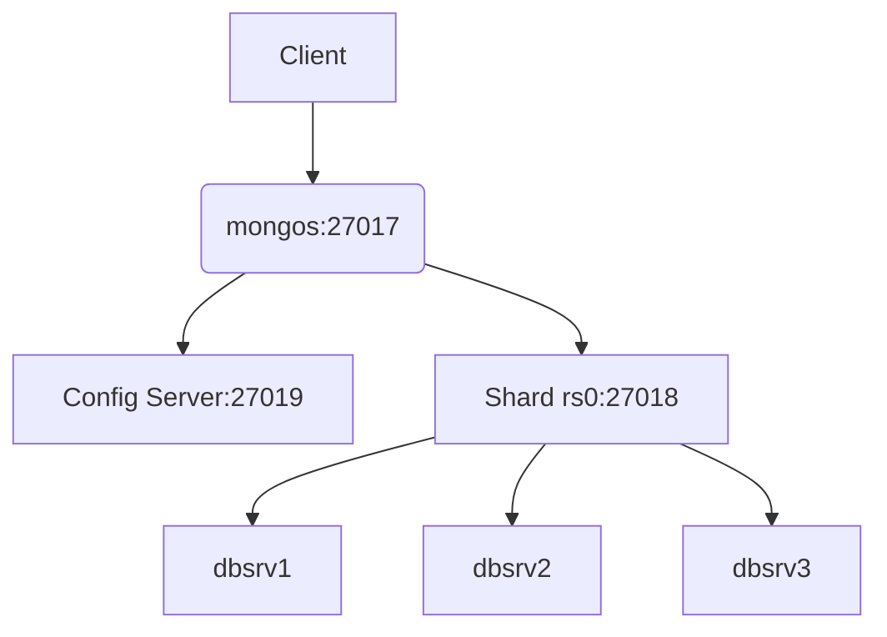

Voici une procédure détaillée pour mettre en place un cluster MongoDB shardé sur trois serveurs (192.168.56.191, 192.168.56.192, 192.168.56.193), nommés dbsrv1, dbsrv2, dbsrv3. 

Cette architecture suppose que chaque serveur peut héberger plusieurs rôles (configuration, shard, routeur), mais pour une installation de production robuste, il est recommandé de séparer les rôles sur des machines distinctes ou de prévoir la réplication des serveurs de configuration[1][2].

## 1️⃣ Préparation des serveurs

Assurez-vous que MongoDB est installé sur chaque serveur. Créez les répertoires nécessaires pour les données et la configuration.

```bash
# Sur chaque serveur
mkdir -p /data/configdb
mkdir -p /data/sharddb
chown -R mongod:mongod /data/
```

## 2️⃣ Configuration des serveurs de configuration (config servers)

Le serveur de configuration stocke les métadonnées du cluster shardé. Ici, on utilise un seul serveur de configuration pour la simplicité, mais il est préférable d’en avoir trois en production pour la tolérance aux pannes.

**Sur dbsrv1 :**

```bash
mongod --configsvr --dbpath /data/configdb --port 27019 --bind_ip 192.168.56.191
```
> **Remarque** : En production, démarrez un serveur de configuration sur chaque nœud et configurez-les en réplica set[1][2].

## 3️⃣ Configuration des shards (Replica Set)

Chaque shard est en général un replica set pour la résilience. Pour ce tutoriel, on crée un seul shard répliqué sur les trois serveurs.

**Sur chaque serveur, démarrez mongod en tant que shard :**

```bash
mongod --shardsvr --replSet rs0 --dbpath /data/sharddb --port 27018 --bind_ip 0.0.0.0
```
> **Remarque** : `--bind_ip 0.0.0.0` permet l’accès depuis n’importe quelle interface, mais ajustez selon votre politique de sécurité.

**Initialisation du replica set :**

Connectez-vous à l’un des serveurs (ex. dbsrv1) :

```bash
mongo --host 192.168.56.191 --port 27018
```

Dans le shell MongoDB :

```javascript
rs.initiate({
  _id: "rs0",
  members: [
    { _id: 0, host: "192.168.56.191:27018" },
    { _id: 1, host: "192.168.56.192:27018" },
    { _id: 2, host: "192.168.56.193:27018" }
  ]
})
```
Vérifiez le statut :

```javascript
rs.status()
```


## 4️⃣ Démarrage du routeur (mongos)

Le routeur mongos est le point d’entrée des applications clients. Il doit être démarré sur au moins un serveur.

**Sur dbsrv1 :**

```bash
mongos --configdb 192.168.56.191:27019 --port 27017 --bind_ip 192.168.56.191
```
> **Remarque** : En production, il est recommandé de démarrer mongos sur plusieurs serveurs pour la haute disponibilité[1][2].

## 5️⃣ Ajout du shard au cluster

Connectez-vous au shell mongos :

```bash
mongo --host 192.168.56.191 --port 27017
```

Ajoutez le shard (le replica set) au cluster :

```javascript
sh.addShard("rs0/192.168.56.191:27018,192.168.56.192:27018,192.168.56.193:27018")
```
Vérifiez le statut du sharding :

```javascript
sh.status()
```


## 6️⃣ Activation du sharding pour une base de données

Activez le sharding pour une base de données (ex. "mydb") :

```javascript
sh.enableSharding("mydb")
```
Vous pouvez ensuite sharder une collection avec une clé de sharding :

```javascript
sh.shardCollection("mydb.mycollection", { "_id": "hashed" })
```


## 7️⃣ Résumé des ports utilisés

| Serveur      | Rôle principal         | Port utilisé   |
|--------------|-----------------------|----------------|
| dbsrv1       | Config, mongos, shard | 27019, 27017, 27018 |
| dbsrv2       | Shard                 | 27018          |
| dbsrv3       | Shard                 | 27018          |

## 📊 Diagramme d’architecture simplifié



## ✅ Avantages

- **Scalabilité horizontale** : Répartition des données sur plusieurs serveurs.
- **Haute disponibilité** : Utilisation de replica sets pour chaque shard.
- **Gestion centralisée** : Point d’entrée unique via mongos.

## ❌ Inconvénients

- **Complexité** : Configuration et maintenance plus avancées.
- **Risque de SPOF** : Si un seul serveur de configuration ou mongos, risque de panne.
- **Latence** : Communication réseau entre les composants peut ralentir les requêtes.

## ⚠️ Points de vigilance

- **Sécurité** : Restreignez les accès réseau et utilisez l’authentification.
- **Backup** : Sauvegardez régulièrement les serveurs de configuration et les shards.
- **Monitoring** : Surveillez l’état du cluster et l’équilibrage des données.

## Exemple de commandes récapitulatives

```bash
# Config server (dbsrv1)
mongod --configsvr --dbpath /data/configdb --port 27019 --bind_ip 192.168.56.191

# Shard servers (dbsrv1, dbsrv2, dbsrv3)
mongod --shardsvr --replSet rs0 --dbpath /data/sharddb --port 27018 --bind_ip 0.0.0.0

# mongos (dbsrv1)
mongos --configdb 192.168.56.191:27019 --port 27017 --bind_ip 192.168.56.191

# Initialisation du replica set (dans le shell mongod)
rs.initiate({ _id: "rs0", members: [ ... ] })

# Ajout du shard (dans le shell mongos)
sh.addShard("rs0/192.168.56.191:27018,192.168.56.192:27018,192.168.56.193:27018")

# Activation du sharding
sh.enableSharding("mydb")
sh.shardCollection("mydb.mycollection", { "_id": "hashed" })
```

[1] https://kinsta.com/fr/blog/sharding-mongodb/
[2] https://easyteam.fr/actualites/deployer-une-architecture-mongodb-en-sharding/
[3] https://blog.hachther.com/index.php/2017/08/28/comment-deployer-un-cluster-mongodb-version-3-4/
[4] https://severalnines.com/blog/turning-mongodb-replica-set-sharded-cluster/
[5] https://serverspace.io/fr/support/help/mongodb-cluster-configuration/
[6] https://welovedevs.com/fr/articles/mongo-shard/
[7] https://www.webhi.com/how-to/fr/guide-de-partitionnement-et-de-replication-de-mongodb/
[8] https://fr.scribd.com/document/480532272/Tuto-Sharding
[9] https://www.mongodb.com/fr-fr/resources/products/fundamentals/clusters
[10] https://forums.percona.com/t/3-node-sharded-mongodb-cluster-on-a-budget/13156